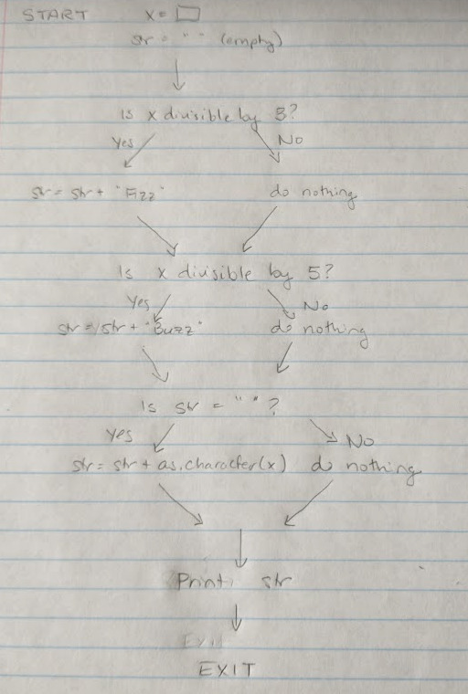
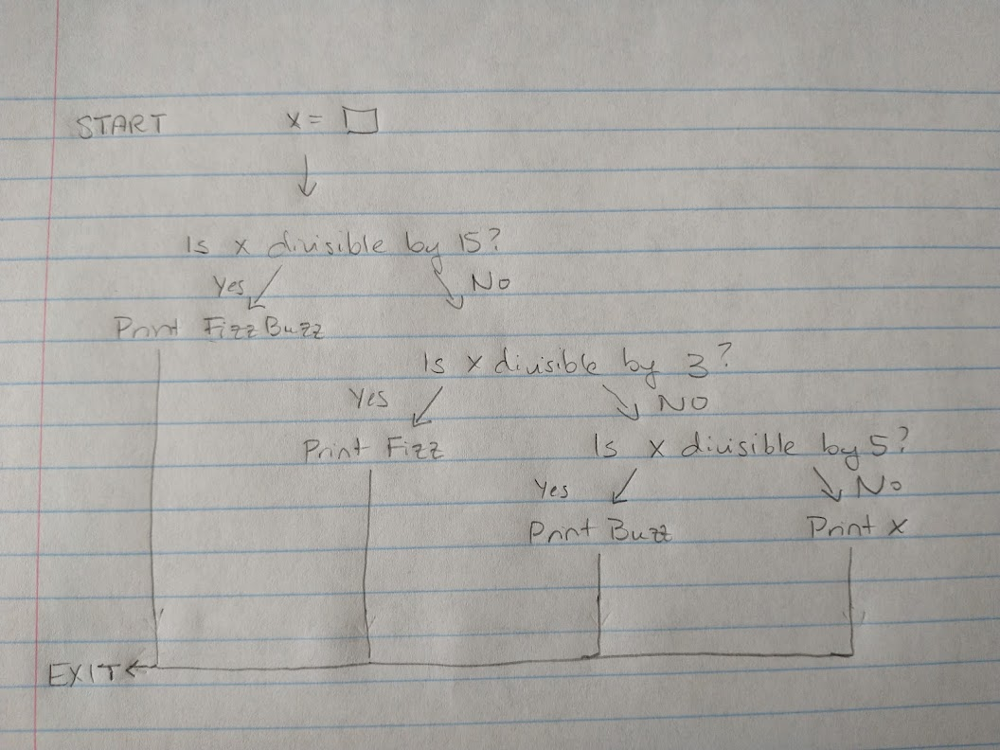

```{r setup, include=FALSE}
knitr::opts_chunk$set(echo = TRUE)
options(digits = 3)
```

```{r load-sas-libraries, echo = F, message = F, warning = F}
# Delete this chunk if you're using SAS without SASMarkdown
saspath <- "/usr/local/SASHome/SASFoundation/9.4/bin/sas_en" # Your SAS path goes here
sasopts <- "-ls 75"
knitr::opts_chunk$set(engine.path=list(sas=saspath, saslog=saspath, sashtml=saspath),
                      engine.opts=list(sas=sasopts, saslog=sasopts, sashtml=sasopts), 
                      comment=NA)
library(SASmarkdown)
```
## Instructions
This homework has two main problems. You should edit only the code chunks (and not the structure of the rest of the document) and the author: statement at the top of the file. 

When you are finished with the assignment: 

1. Save the file as 02_Lastname_Firstname.Rmd and compile it
2. Commit the Rmd file and corresponding html file to your homework git repo
3. Push the commit to github
4. Locate the Rmd file on github and click on the SHA link for the file
5. Paste the url of the resulting page into Canvas to submit your assignment.

If you are using SASMarkdown, your assignment must compile on a different computer as long as the saspath is set correctly for that machine.
If you are not using SASMarkdown, your assignment must compile on a different computer so long as the working directory is set to the repository. Your code must run on my machine -- which means you should use local paths ("./amazon_books.csv") rather than global paths to files.

## FizzBuzz

The "FizzBuzz Test" is a famous programming interview question. 
> Write a program that prints the numbers from 1 to 30. But for multiples of three print “Fizz” instead of the number and for the multiples of five print “Buzz”. For numbers which are multiples of both three and five print "FizzBuzz"

First, start out by sketching out the program flow. You can use a formal [flowchart](https://www.programiz.com/article/flowchart-programming) or you can use an informal style, but your sketch should have arrows, an entry point, and an exit point, along with several branches. Scan in and save your program flow map in this project directory, and then add the file name in the parentheses below.




In the R chunk below, write code which will solve this problem. 

```{r fizzbuzz-solution, echo = T}
# This solution uses string concatenation - it does not require if/else statements
for (i in 1:30) {
  # FizzBuzz code goes here
  str <- "" # start with an empty string
  if(i %% 3 == 0) {
    # If i is divisible by 3, add Fizz to the string
    str <- paste(str, "Fizz", sep = "")
  }
  if (i %% 5 == 0) {
    # If i is divisible by 5, add Buzz to the string
    str <- paste(str, "Buzz", sep = "")
  }
  if (str == "") {
    # If str is still empty, then i is not divisible by 3 or 5
    # so print the number itself
    str <- as.character(i)
  }
  print(str)
}


```


You can also use an if-else statement. 
```{r fizzbuzz-solution2, echo = T}
# This solution uses if/else statements
for (i in 1:30) {
  # FizzBuzz code goes here
  if(i %% 15 == 0) {        # Handle multiples of 3 and 5 (so 15) first
    str <- "FizzBuzz"
  } else if (i %% 5 == 0) { # Then, you know anything that isn't a multiple of
    str <- "Buzz"           # 15 and is a multiple of 5 isn't divisible by 3
  } else if (i %% 3 == 0) { # And so if something isn't divisible by 5, you 
    str <- "Fizz"           # also need to check divisibility by 3
  } else {
    str <- as.character(i)  # Then, if none of those conditions hold, print the 
  }                         # number
  print(str)
}


```

In the sas chunk, or in the fizzbuzz.SAS file that is part of this repository, write similar code which will solve this problem. Note: if you are not using SASMarkdown, you can delete the sashtml chunk below and the R chunk that reads the sas log file. 

```{sashtml fizzbuzz-sas, error = T}
/* This solution uses string concatenation */
PROC IML;
/* FizzBuzz code goes here */
z = '';
DO i = 1 to 30;
  a = '';
  IF MOD(i, 5)=0 THEN DO;
      a = cats(a,"Fizz");
  END;
  if MOD(i,3)=0 THEN DO;
      a = cats(a,"Buzz");
  END;
  IF a = '' THEN DO;
      a = cats(a, i);
  END;
  z = catx(' ', z, a);
END;
PRINT z;
QUIT;
```


```{r fizzbuzz-sas2, engine="sashtml", engine.path=saspath, engine.opts=sasopts, error = T}
/* This solution uses a different invocation of SASmarkdown - both work on my machine */
/* Here, Ive used string concatenation, but stored everything in column vectors */
/* The results are much neater when printed out */
PROC IML;

/* FizzBuzz code goes here */
  
  fbres = J(30,1,"         "); /* J(nrow, ncol, value) creates a constant matrix */
  fbnum = t(1:30); /* a:b creates a row vector, so we need transpose to get a col vector */

  DO i = 1 TO 30;
    x = ''; /* start with an empty string var */
    
    /* the cats(a, b) function concatenates strings, so cats('a', 'b') is 'ab' */
    IF mod(i, 3) = 0 THEN DO; 
      x = cats(x, "FIZZ"); 
    END;
    IF mod(i, 5) = 0 THEN DO;
      x = cats(x, "BUZZ"); 
    END;
    
    /* if x is still empty, put a number in it */
    IF x = '' THEN DO;
      x = cats(x, i); 
    END;
    /* store the completed x in a[i] */
    fbres[i] = x; 
  END;
  PRINT fbnum fbres;

QUIT;
```

```{r fizzbuzz-sas3, engine="sashtmllog", engine.path=saspath, engine.opts=sasopts, error = T}
/* This solution uses if-else statements and prints the results out one-by-one */
/* I have used engine='sashtmllog' in the code chunk so that the log file prints out */
PROC IML;
DO x = 1 TO 30;
	IF mod(x,3) = 0 & mod(x,5) = 0 THEN PRINT 'fizzbuzz';
	ELSE IF mod(x,3) = 0 THEN PRINT 'fizz';
  ELSE IF mod(x,5) = 0 THEN PRINT 'buzz';
	ELSE print x;
END;
QUIT;
```


```{r fizzbuzz-sas4, engine="sashtml", engine.path=saspath, engine.opts=sasopts, error = T}
/* This solution uses if-else statements and prints the results out as a vector */
PROC IML;
  
  fbres = J(30,1,"         "); /* J(nrow, ncol, value) creates a constant matrix */
  fbnum = t(1:30); /* a:b creates a row vector, so we need transpose to get a col vector */

  DO i = 1 TO 30;
    x = '        '; /* start with a string of length 8 (so that there's enough memory) */
    
    /* the cats(a, b) function concatenates strings, so cats('a', 'b') is 'ab' */
    IF mod(i, 15) = 0 THEN x = "FIZZBUZZ"; 
    ELSE IF mod(i, 5) = 0 THEN x = "BUZZ";
    ELSE IF mod(i, 3) = 0 THEN x = "FIZZ";
    ELSE x = cats(x, i); /* must convert i to a string using cats */
  
    fbres[i] = x; 
  END;
  PRINT fbnum fbres;

QUIT;
```

## Linear Regression

In linear regression, we have variables $\mathbf{Y}$ and $\mathbf{X}$ and want to find $\beta$ such that $\mathbf{Y} = \mathbf{X}\beta + \epsilon$. $\hat{\mathbf{b}}$, the best estimate of $\beta$, is typically obtained using the method of least squares, that is $\hat b = (\mathbf{X}^{T}\mathbf{X})^{-1}\mathbf{X}^T\mathbf{Y}$. Using this formula, fill in the chunks below to implement least squares regression from scratch. Store your results in the variable `res`.

The dataset you will use is a list of books scraped from Amazon, with the amazon price, list price, cover type (hardback or paperback) and number of pages. Your goal is to predict the amazon price based off of the list price, cover type, and number of pages.

You can see more information about the data [here](https://dasl.datadescription.com/datafile/amazon-books/?_sfm_methods=Multiple+Regression&_sfm_cases=4+59943)

```{r linear-reg-setup, message = F}
# Do not edit this portion of the file
if ("readr" %in% installed.packages()) {
  library(readr)
} else {
  install.packages("readr")
  library(readr)
}


url <- "https://dasl.datadescription.com/download/data/3052"
download.file(url, destfile = "amazon_books.csv")
df <- read_tsv("amazon_books.csv")                                  # Read in the data
df <- na.omit(df[,c(1, 3, 4, 5, 6)])                 # Remove missing observations
df <- df[df$`List Price` < 60,]                      # Remove extreme observations
df$Hardcover <- df$`Hard/ Paper` == "H"              # Make character into
                                                     # binary quantity 
                                                     # (0 = paperback, 1 = hardcover)

# Write data out for SAS
write_csv(df[,c("Amazon Price", "List Price", "Hardcover", "NumPages")], 
          path = "amazon_books.csv", na = ".")

X <- df[,c("List Price", "Hardcover", "NumPages")]   # Get variables of interest
names(X) <- c("List", "Hardcover", "Pages")          # Rename for simplicity
                                                     
X1 <- as.matrix(X)       # Convert to numerical matrix (not data frame)

X <- cbind(Intercept = 1, X1) # Add an extra column of 1s for the intercept
Y <- df$`Amazon Price`

# X and Y are now defined properly.

# Compare your results to lm's results
lm(Y ~ X1)$coefficients

res <- rep(NA, 4)
```

```{r my-linear-regression}
# Edit this chunk
# ------------------------------------------------------------------------------
# Find the estimated coefficients for each of the explanatory variables using 
# simple matrix operations
# Store your answer in res: 
# res <- .....


# ------------------------------------------------------------------------------
# Do not edit this
print(res) 
```

The regression equation is $\text{Amazon Price} = `r res[1]` + `r res[2]`(\text{List Price}) `r res[3]`(\text{is Hardcover})  `r res[4]`(\text{# Pages})$


If you are using SASMarkdown, fill your SAS code in below. Otherwise, delete this chunk, and fill your code in using the linear-reg.SAS file in this repository.

```{r my-linear-regression-sas2, engine="sashtml", engine.path=saspath, engine.opts=sasopts, error = T}
PROC IMPORT datafile = "amazon_books.csv" out=books
  DBMS = csv /* comma delimited file */
  REPLACE;
  GETNAMES = YES;
  
PROC REG data=books;
    MODEL Amazon_Price = List_Price Hardcover NumPages;
RUN;

PROC IML;
USE books;
   read all var _NUM_ INTO X1[colname=varname]; /* Read numeric vars */
CLOSE books;
  
Y = X1[,1]; /* Y pulled out */
X1[,1] = 1; /* Intercept column */
varname[1] = "Intercept";
varname_t = varname`; /* Make them a column vector to match the fitted coefs */
/* PRINT Y X1 varname_t;*/ /* Just checking */

xt = X1`;
xtxinv = inv(xt * X1);
xty = xt * Y;
res = xtxinv * xty;
PRINT varname_t res; /* Print coefs with labels */
QUIT;
```
